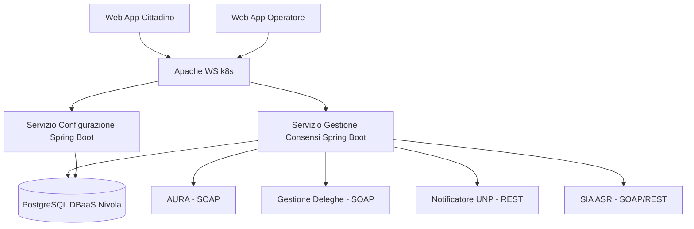

---
{"dg-publish":true,"permalink":"/wiki/concepts/architettura-iaas/","title":"Architettura IaaS","tags":["infrastruttura","iaas","cloud","nivola","csi-piemonte"],"dg-note-properties":{"title":"Architettura IaaS","aliases":["Architettura IaaS"],"type":"concept","tags":["infrastruttura","iaas","cloud","nivola","csi-piemonte"],"created":"2026-05-05","updated":"2026-06-17","sources":["2026-03-02-conspref-srs-v1-revised","2026-03-12-pile-tecnologiche-csi"],"related":["[[CSI Piemonte]]","[[2026-03-12-pile-tecnologiche-csi|Pile Tecnologiche CSI Piemonte]]","[[Gestione Consensi - Applicativo]]"]}}
---


# Architettura — Infrastruttura Progetto

> ⚠️ **Aggiornamento verbale 11/06/2026:** L'ambiente è **IaaS e non Docker/ECaaS** per tutti gli ambienti (DEV, TEST, PROD). Provisioning in carico a [[wiki/entities/csi-piemonte\|CSI Piemonte]] su indicazioni precise di Exprivia. Skeleton del progetto in carico a Exprivia. Le sezioni Kubernetes/ECaaS sotto erano basate su SRS §3.5 — potrebbero non applicarsi: verificare con CSI prima della fase di provisioning.

Infrastruttura cloud [[wiki/entities/csi-piemonte\|CSI Piemonte]] su Nivola per il progetto [[wiki/concepts/gestione-consensi-applicativo\|Gestione Consensi - Applicativo]]. Ambiente **IaaS** (non ECaaS/Kubernetes) per tutti gli ambienti.

---

## Componenti infrastrutturali

| Componente | Tecnologia | Note |
|---|---|---|
| Orchestrazione | **(da definire per IaaS — era ECaaS/Kubernetes)** | Verificare con CSI prima del provisioning |
| IngressController | **TRAEFIK** (solo questo) | No altri IngressController |
| Storage | NFS via StorageClass CSI Trident (NetApp) | No host volumes |
| Monitoraggio | Prometheus | Metriche e alert |
| Log | Stack ELK (ElasticSearch + LogStash + Kibana) | Log centralizzati |
| CNI | Cilium | NetworkPolicy gestite centralmente |
| Deploy | Helm + GitOps | Rollout automatico al tag push GitLab |
| Registry immagini | Artifactory CSI | Solo docker-trusted, docker-base, docker-projects |

---

## Vincoli architetturali obbligatori

- **No** KNative, Istio, network mesh
- **No** installazioni software a livello Cluster
- **No** immagini esterne ad Artifactory CSI
- Ogni Deployment: `resources.requests` e `resources.limits` obbligatori
- Ogni Deployment: `livenessProbe` e `readinessProbe` obbligatori
- Helm chart: solo dipendenze da chart CSI (helm-base, helm-projects)

---

## Registry immagini per il progetto

| Registry | Scopo |
|---|---|
| docker-trusted | Immagini pubbliche validate, as-is |
| docker-base | Immagini customizzate CSI (httpd_csi, angular, spring-boot) |
| docker-projects | Immagini build del progetto |

**Immagini di riferimento progetto:**
- Backend: `reference/spring-boot` (docker-base)
- Frontend: `angular` (docker-base)
- Web Server: `httpd_csi` (docker-base)

---

## Pipeline CI/CD

```
Push/Tag GitLab → Jenkins build → Dockerfile analisi → 
Artifactory push → SonarQube analisi → GitOps rollout
```

---

## DBaaS Nivola (database)

Il DB è **esterno all'applicativo** — erogato come servizio gestito da Nivola (DBaaS).
- Provisioning via scheda formale a Nivola (alta latenza)
- Backup, patching, HA: gestiti da Nivola
- Credenziali: mai nel codice → gestite lato infrastruttura IaaS CSI → variabili env Spring
- HikariCP: max-pool-size ≤ 40/replica (istanza 100 conn max, 2 repliche)

---

## Accesso alla piattaforma

- Utenza CSI richiesta per consulenti Exprivia
- Rancher CLI + kubeconfig da referente CSI
- Console web: nivola-rancher2.nivolapiemonte.it (OpenLDAP)

---

## Diagramma di alto livello (Mermaid)



---

## ADR correlati

| ADR | Decisione |
|---|---|
| [ADR-002](ADR-002-piattaforma-ecaas.md) | Piattaforma ECaaS Kubernetes Nivola + vincoli |
| [ADR-003](ADR-003-dbaas-nivola.md) | DBaaS Nivola esterno al namespace ECaaS |
