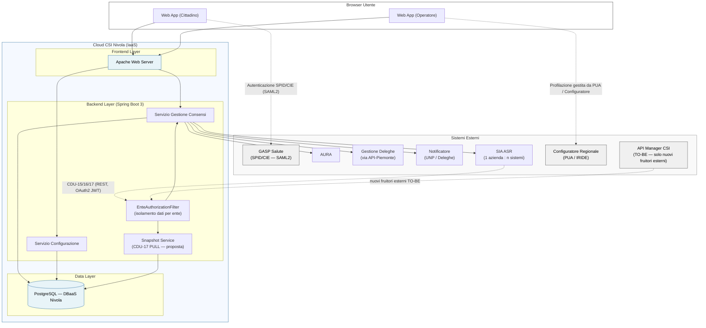

---
{"dg-publish":true,"permalink":"/wiki/sources/2026-05-05-mermaid-architettura/","title":"Diagramma Architettura Sistema — Mermaid","tags":["architettura","mermaid","diagramma","to-be","frontend","backend"],"dg-note-properties":{"title":"Diagramma Architettura Sistema — Mermaid","aliases":["Diagramma Architettura Sistema — Mermaid"],"type":"source","tags":["architettura","mermaid","diagramma","to-be","frontend","backend"],"created":"2026-05-05","updated":"2026-06-17","sources":[],"related":["[[Architettura IaaS]]","[[Gestione Consensi - Applicativo]]","[[Sistemi Esterni Integrati]]","[[GASP Salute]]"]}}
---

# Diagramma Architettura Sistema (Mermaid.txt)

**File:** `raw/Mermaid.txt`
**Formato:** Mermaid graph TD
**Rilevanza:** Diagramma architetturale ufficiale del sistema TO-BE. Fonte visuale del contratto architetturale concordato con [[wiki/entities/csi-piemonte\|CSI Piemonte]].

---

## Contenuto del diagramma

---

## Note di interpretazione

- **Due servizi backend separati:** Servizio Gestione Consensi (logica CDU) e Servizio Configurazione (parametri/informative) — coerente con SRS §4. Vedi [[wiki/concepts/gestione-consensi-applicativo\|Gestione Consensi - Applicativo]].
- **GASP Salute** — nodo separato da CR. Il cittadino accede via **SPID/CIE** direttamente tramite [[wiki/concepts/gasp-salute\|GASP Salute]], senza transitare dal Configuratore Regionale (verbale 11/06/2026).
- **CR (Configuratore Regionale / PUA / IRIDE)** — esclusivamente per profilazione operatori. Linee tratteggiate = dipendenza esterna, non chiamata diretta applicativa.
- **SIA ASR** — relazione **1 azienda : n sistemi** (verbale 11/06/2026). Un'ASR può avere più sistemi SIA; se uno è in manutenzione, CSI interrompe l'invio verso tutti. Vedi [[wiki/concepts/batch-processes\|Processi Batch]] §Gestione Manutenzione ASR.
- **Infrastruttura [[wiki/concepts/architettura-iaas\|Architettura IaaS]]:** ambiente IaaS Nivola (non ECaaS/Kubernetes) per tutti gli ambienti (verbale 11/06/2026).

- **EnteAuthorizationFilter + Snapshot Service** — aggiunti al Backend Layer per recepire il modello di sicurezza CDU-15/16 e il CDU-17 PULL (proposta tecnica) del documento SRS §3.3/§6.17.
- **API Manager CSI** — nodo separato, **solo TO-BE per nuovi fruitori esterni** (verbale 11/06/2026); NON è sul percorso AS-IS Frontend→Backend.

> ✅ **Aggiornamento 2026-06-18:** il nodo "API Gateway" sul percorso AS-IS (Apache→Backend) è stato **rimosso** per allineamento all'SRS §3.2 (integrazione diretta, nessun gateway per i fruitori AS-IS; Spring Security a livello applicativo). L'esposizione via **API Manager CSI** resta come canale TO-BE per i soli nuovi fruitori esterni. Rimosso anche il riferimento all'immagine ECaaS `httpd_csi · docker-base` (modello ECaaS superato → IaaS). Restano da definire con CSI i dettagli operativi IaaS (deploy/ingress/TLS).
