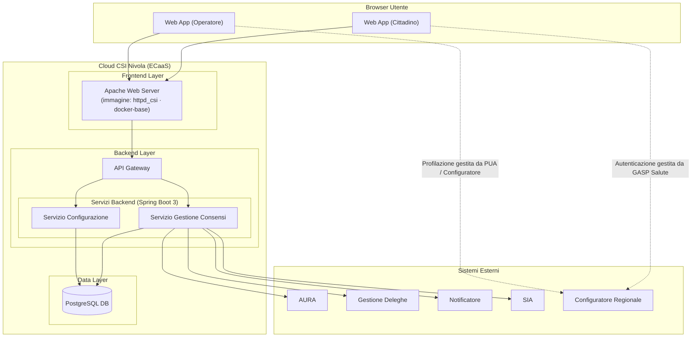

---
{"dg-publish":true,"permalink":"/wiki/sources/2026-05-05-mermaid-architettura/","title":"Diagramma Architettura Sistema — Mermaid","tags":["architettura","mermaid","diagramma","to-be","frontend","backend"],"dg-note-properties":{"title":"Diagramma Architettura Sistema — Mermaid","aliases":["Diagramma Architettura Sistema — Mermaid"],"type":"source","tags":["architettura","mermaid","diagramma","to-be","frontend","backend"],"created":"2026-05-05","updated":"2026-05-05","sources":[],"related":["[[Architettura ECaaS]]","[[Gestione Consensi - Applicativo]]","[[Sistemi Esterni Integrati]]","[[GASP Salute]]"]}}
---

# Diagramma Architettura Sistema (Mermaid.txt)

**File:** `raw/Mermaid.txt`
**Formato:** Mermaid graph TD
**Rilevanza:** Diagramma architetturale ufficiale del sistema TO-BE. Fonte visuale del contratto architetturale concordato con [[wiki/entities/csi-piemonte\|CSI Piemonte]].

---

## Contenuto del diagramma

---

## Note di interpretazione

- **Due servizi backend separati:** Servizio Gestione Consensi (logica CDU) e Servizio Configurazione (parametri/informative) — coerente con SRS §4. Vedi [[wiki/concepts/gestione-consensi-applicativo\|Gestione Consensi - Applicativo]].
- **CR (Configuratore Regionale)** rappresenta [[wiki/concepts/gasp-salute\|GASP Salute]] + PUA come punto esterno di autenticazione/profilazione — linee tratteggiate = dipendenza esterna, non chiamata diretta applicativa.
- **SIA** nel diagramma = [[wiki/concepts/sistemi-esterni-integrati\|Sistemi Esterni Integrati]] SIA delle ASR (target BATCH-01/03 e consumatori CDU-15/16).
- **Infrastruttura [[wiki/concepts/architettura-ecaas\|Architettura ECaaS]]:** Apache WS è `httpd_csi` da docker-base Artifactory CSI.

> ⚠️ **Conflict:** Il diagramma mostra un nodo "API Gateway" (AG) come layer dedicato tra Apache e Spring Boot. L'SRS §3.4 (confermato da CSI nel Q&A) specifica che **non è previsto un API Gateway separato** — Spring Security gestisce direttamente autenticazione/autorizzazione. Il nodo "AG" nel diagramma potrebbe rappresentare il routing Apache (TRAEFIK) o un'intenzione non recepita nell'SRS. Da chiarire con [[wiki/entities/csi-piemonte\|CSI Piemonte]] prima dell'implementazione.
